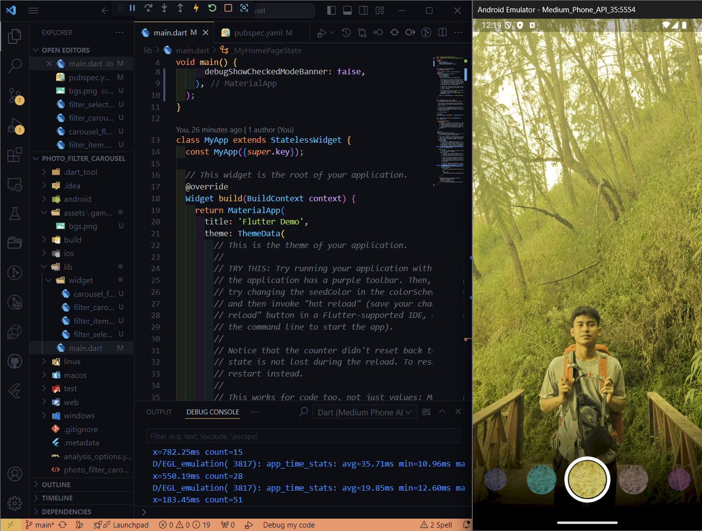

#### **Nama : Sukma Bagus Wahasdwika**

#### **NIM  : 2241720223**

#

# Tugas Praktikum

1. Selesaikan Praktikum 1 dan 2, lalu dokumentasikan dan push ke repository Anda berupa screenshot setiap hasil pekerjaan beserta penjelasannya di file README md! Jika terdapat error atau kode yang tidak dapat berjalan, silakan Anda perbaiki sesuai tujuan aplikasi dibuat!

    **PRAKTIKUM 1 : https://github.com/bagusswahasdwikaa/kamera_flutter**

    * Take A Picture 
    

    

    * Display The Picture
    
    

    

    **PRAKTIKUM 2 : https://github.com/bagusswahasdwikaa/photo_filter_carousel**

    

2. Gabungkan hasil praktikum 1 dengan hasil praktikum 2 sehingga setelah melakukan pengambilan foto, dapat dibuat filter carouselnya!

    **https://github.com/bagusswahasdwikaa/kamera_filter_flutter**

3. Jelaskan maksud void async pada praktikum 1?

4. Jelaskan fungsi dari anotasi @immutable dan @override ?

5. Kumpulkan link commit repository GitHub Anda kepada dosen yang telah disepakati!