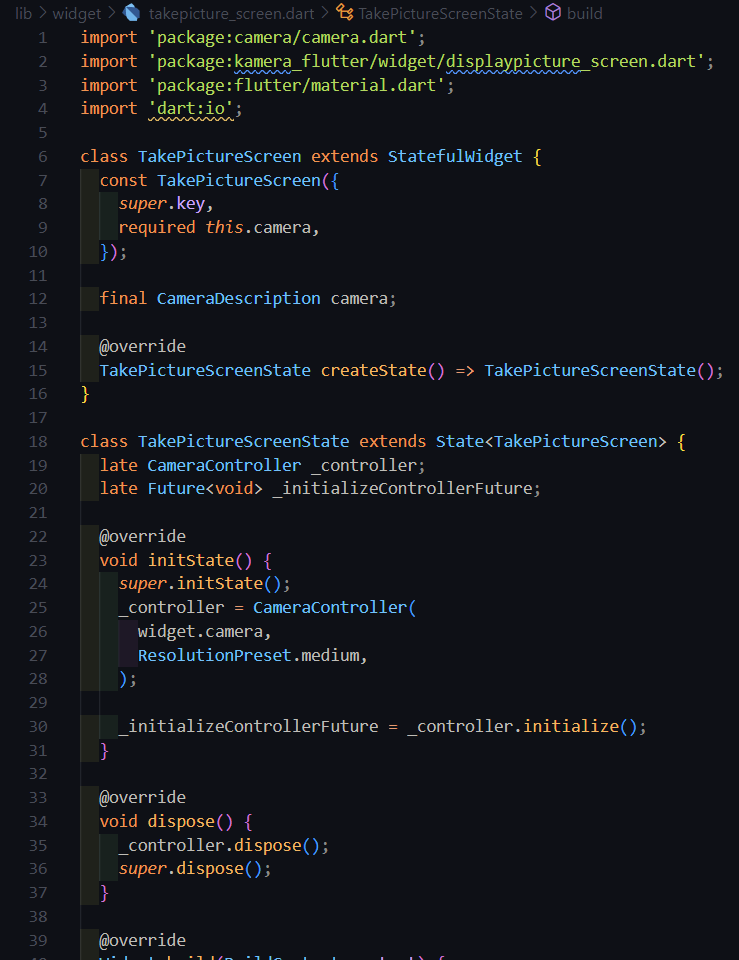
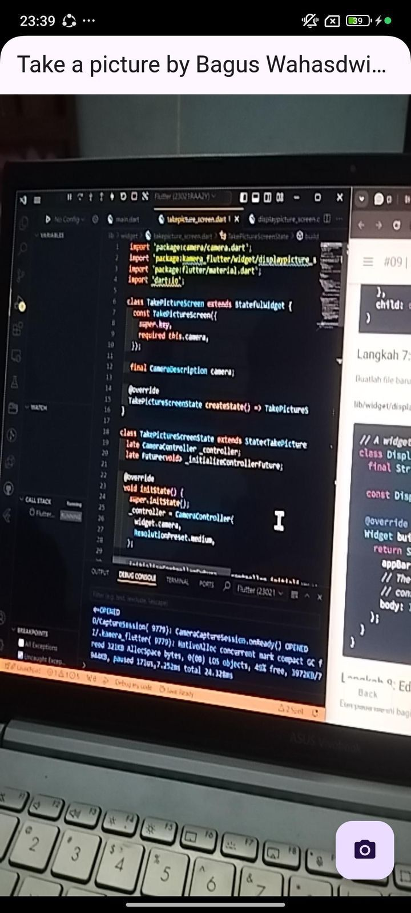
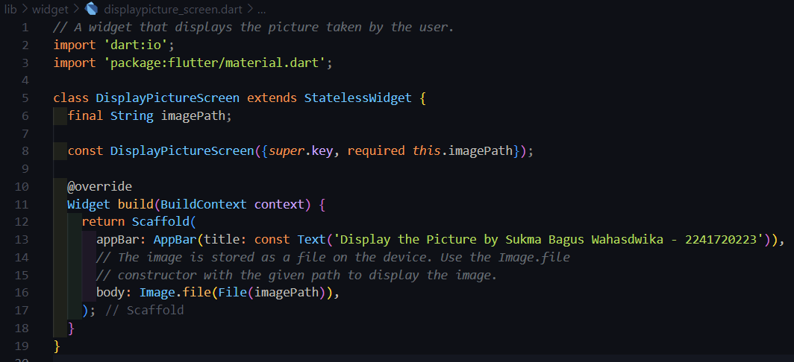
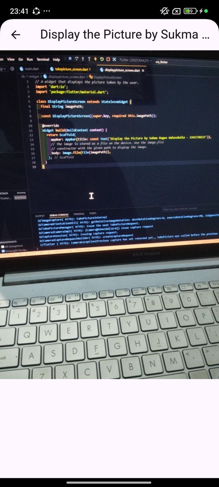
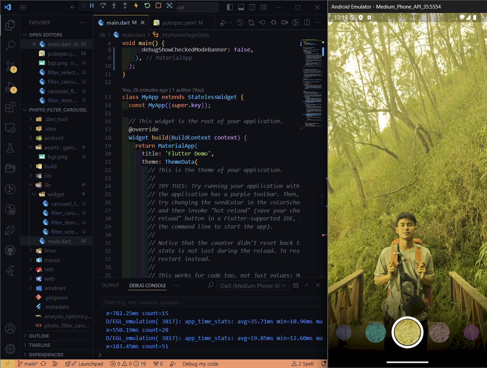
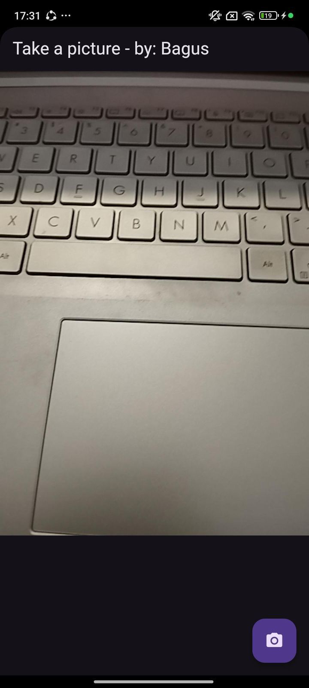
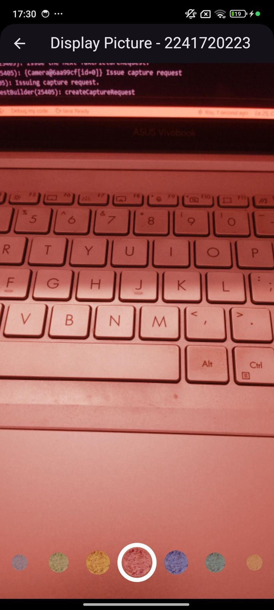

#### **Nama : Sukma Bagus Wahasdwika**

#### **NIM  : 2241720223**

#

# Tugas Praktikum

1. Selesaikan Praktikum 1 dan 2, lalu dokumentasikan dan push ke repository Anda berupa screenshot setiap hasil pekerjaan beserta penjelasannya di file README md! Jika terdapat error atau kode yang tidak dapat berjalan, silakan Anda perbaiki sesuai tujuan aplikasi dibuat!

    **PRAKTIKUM 1 : https://github.com/bagusswahasdwikaa/kamera_flutter**

    * Take A Picture 
    

    

    * Display The Picture

    

    

    **PRAKTIKUM 2 : https://github.com/bagusswahasdwikaa/photo_filter_carousel**

    

2. Gabungkan hasil praktikum 1 dengan hasil praktikum 2 sehingga setelah melakukan pengambilan foto, dapat dibuat filter carouselnya!

    **https://github.com/bagusswahasdwikaa/kamera_filter_flutter**

    * Pengambilan Foto 

    

    * Hasil Pengambilan Foto dengan dibuat Filter Carousel

    

3. Jelaskan maksud void async pada praktikum 1?

    * Fungsi Future main() async { ... } menunjukkan bahwa main() adalah fungsi asinkron yang mungkin menjalankan operasi yang memerlukan waktu atau menunggu respons dari sumber daya eksternal (seperti inisialisasi plugin). Fungsi ini tidak mengembalikan nilai apa pun.

4. Jelaskan fungsi dari anotasi @immutable dan @override ?

    * @immutable digunakan untuk menandakan bahwa suatu kelas bersifat "immutable" atau tidak bisa diubah setelah instansiasi. Ini berarti semua properti dalam kelas tersebut bersifat final atau konstan, sehingga nilainya tetap setelah objek dibuat. Hal ini berguna untuk mencegah perubahan data yang tidak disengaja, menjaga konsistensi data, serta memudahkan pemahaman dan pemeliharaan kode.

5. Kumpulkan link commit repository GitHub Anda kepada dosen yang telah disepakati!